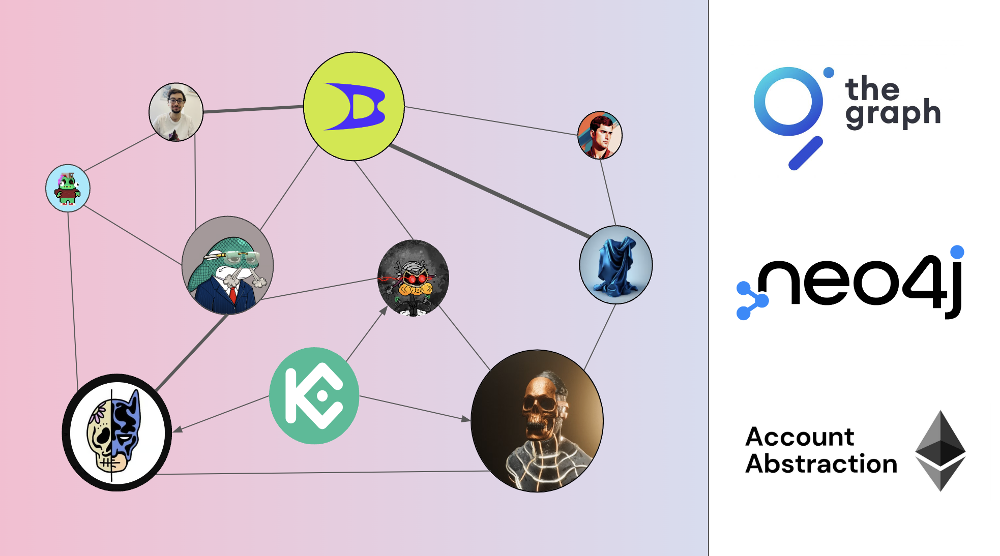

# 🌐 Universal Graph - ETHPrague2024



## Presentation

🌐 Social graph for smart accounts. It highlights interactions through user friendly experience and engagement between EOAs, smart accounts (account abstraction) and smart contracts. The main objective is on chain activity analysis and monitoring.

### Built with

- [The Graph](./api/)
- [Neo4j](https://neo4j.com/)
- [Next.js](https://nextjs.org/)
- [LSPs standards](https://docs.lukso.tech/standards/introduction)

## Getting Started

First, run the development server:

```bash
npm i
npm run dev
```

Open [http://localhost:3000](http://localhost:3000) with your browser to see the result.

## The Graph data

You can run the following commands to query the Graph Node and retrieve some data. This data will be saved in a JSON file.

```bash
npm run graph:profile

# or

npm run graph:assets

# or

npm run graph:txs
```
